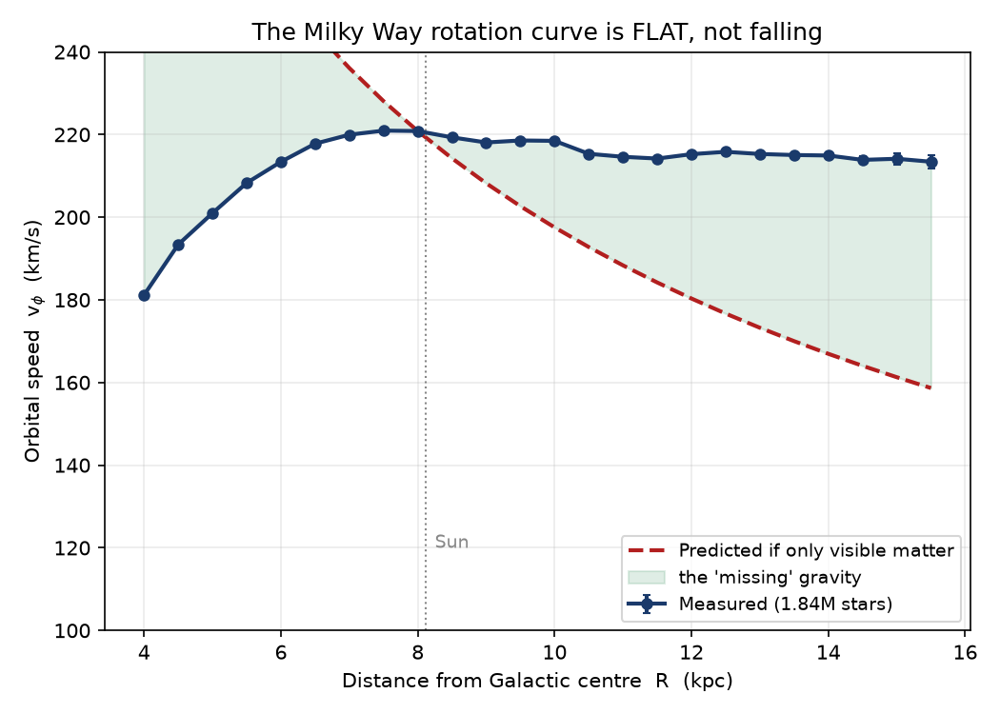

# The Milky Way's Hidden Mass: Big-Data Profiling of Gaia DR3

**CS 131 Big Data Final Project | Arpanjeet Singh (Group 17)**

Measuring the rotation of the Milky Way from **129 million stars** to detect dark matter,
and profiling the tools that make (or break) big-data work along the way.



> **The result:** the Galaxy's rotation curve stays **flat (~215 km/s out to 15 kpc)** instead
> of falling the way visible matter alone predicts. That gap means roughly **two-thirds of the
> mass inside 15 kpc emits no light** - dark matter.

---

## The question, in plain terms

Planets far from the Sun orbit slower than planets near it (Neptune is slower than Mercury).
If the Milky Way worked the same way, stars far from the centre should orbit slower than stars
near it. **They don't** - the speed stays flat far out. The only way that works is if there is
extra, invisible mass out there holding the fast outer stars in. That invisible mass is dark
matter, and this project measures it.

## Two goals in one project

1. **A real science question:** build the Galactic rotation curve and test it for dark matter.
2. **A tooling comparison:** show that data too big for memory breaks Excel and pandas, is
   streamed fine by command-line tools, and is handled fast by a distributed engine (Spark),
   which scales as you add machines.

The science justifies the engineering; the engineering makes the science possible.

## Dataset

ESA **Gaia DR3 `gaia_source`** - a full-sky catalogue of ~1.8 billion stars, ~613 GB of
gzipped CSV split into 3,386 HEALPix sky-tile files. We use a spread-out, all-sky slice of
**242 files (53.7 GB, 129,016,649 rows, 152 columns)**, kept in a Google Cloud Storage bucket
and read by Spark via `gs://`. Raw data is never committed (see `.gitignore`).

---

## The four phases and their results

| Phase | What it shows | Key result | Deliverable |
|---|---|---|---|
| **1. Profiling** | CLI tools measure the data without loading it | 64.7M rows, 26 GB counted with a few MB of RAM | [`project/1_profile/profiling.txt`](project/1_profile/profiling.txt) |
| **2. Breaking** | In-memory tools fail on the same data | Excel caps at 1.05M rows; pandas hit 29.3 GB (OOM) | [`project/2_breaking/`](project/2_breaking) |
| **3. Scaling** | Spark on Dataproc scales with machines | 1471s -> 685s -> 364s on 1/2/4 machines (**4.05x**) | [`project/3_scaling/scaling.txt`](project/3_scaling/scaling.txt) |
| **4. Analysis** | The science answer | flat curve; Sun-check 220.9 km/s; ~2/3 dark | [`project/4_poster/`](project/4_poster) |

### Scaling (Phase 3)

| Machines | Cores | Job time | Speed-up |
|---|---|---|---|
| 1 | 4 | 1471 s | 1.00x |
| 2 | 8 | 685 s | 2.15x |
| 4 | 16 | 364 s | 4.05x |

Near-linear, because 242 files = 242 tasks (always more than the cores), so no machine sat idle.

### Validation (Phase 4)

The pipeline was never told the Sun's speed. It returns **v_phi = 220.9 km/s** at the Sun's
radius (8.122 kpc), matching the known value, and agrees with `astropy` to 0.06 km/s. Inward
and vertical motions average zero. That confirms every rotation, sign, and constant is correct.

---

## Repository layout

```
project/
  1_profile/  profiling.txt              exact CLI commands + timings (Phase 1)
  2_breaking/ breaking.txt               Excel + pandas failure write-up (Phase 2)
              try_pandas.py              the pandas out-of-memory demo
              pandas_output.txt          its captured output
              screenshots/               excel_fail.png, pandas_taskmanger_usage.png
  3_scaling/  rotation_curve.py          the PySpark job (runs on Dataproc)
              prototype_transform.py     local physics check vs astropy (Sun-check gate)
              scaling.txt                1/2/4-machine runtimes + method
              results/                   the small aggregated result CSVs
  4_poster/   poster_final.pdf           the full poster (all four phases)
              analysis.ipynb             runnable analysis notebook (figures + conclusion)
              make_plots.py              builds the figures from the result CSVs
              figures/                   the three poster figures
```

---

## How to reproduce

**Phase 1 - profiling (Git Bash):**
```bash
zcat data/*.csv.gz | grep -v '^#' | wc -l          # count rows without loading
zcat data/GaiaSource_000000-003111.csv.gz | grep -v '^#' \
  | awk -F',' 'NR>1 && $10!="" {s+=$10;n++} END{print s/n}'   # mean parallax, streamed
```

**Phase 2 - breaking:**
```bash
python project/2_breaking/try_pandas.py            # watch memory climb until it fails
```

**Phase 3 - scaling on Dataproc** (per machine count N in 1, 2, 4):
```bash
gcloud dataproc clusters create cs131-nN --region=us-central1 --num-workers=N \
    --master-machine-type=n2-standard-4 --worker-machine-type=n2-standard-4 \
    --master-boot-disk-size=100 --worker-boot-disk-size=100 \
    --image-version=2.2-debian12 --max-idle=15m
gcloud dataproc jobs submit pyspark project/3_scaling/rotation_curve.py \
    --cluster=cs131-nN --region=us-central1 \
    -- "gs://<bucket>/raw/*.csv.gz" "gs://<bucket>/out/nN"
gcloud dataproc clusters delete cs131-nN --region=us-central1 --quiet
```

**Phase 4 - figures and notebook:**
```bash
python project/4_poster/make_plots.py              # regenerate the three figures
jupyter notebook project/4_poster/analysis.ipynb   # the full analysis story
```

## Tools

Command-line pipelines (`zcat`, `awk`, `grep`, `sort`) · Excel and pandas (to break them) ·
**PySpark on Google Cloud Dataproc** reading from Cloud Storage · matplotlib and astropy for
analysis and validation.

## Constants used (cited)

R_sun = 8.122 kpc (GRAVITY 2018) · V_circ = 229 km/s (Eilers+ 2019) ·
solar motion (11.1, 12.24, 7.25) km/s (Schonrich+ 2010) · parallax zero-point -17 uas
(Lindegren+ 2021).

## Scope and honesty

The parallax quality cut keeps relatively nearby stars, so the curve reaches ~15 kpc. Over that
range the flat trend already rejects the visible-matter-only prediction. The measured population
median sits a few km/s below the true circular speed due to **asymmetric drift**, a known effect
(not an error - `astropy` reproduces it).
